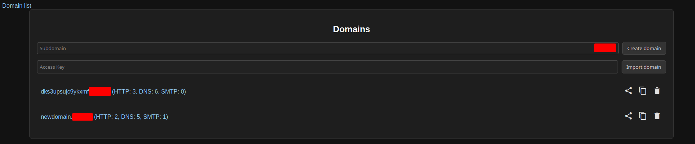
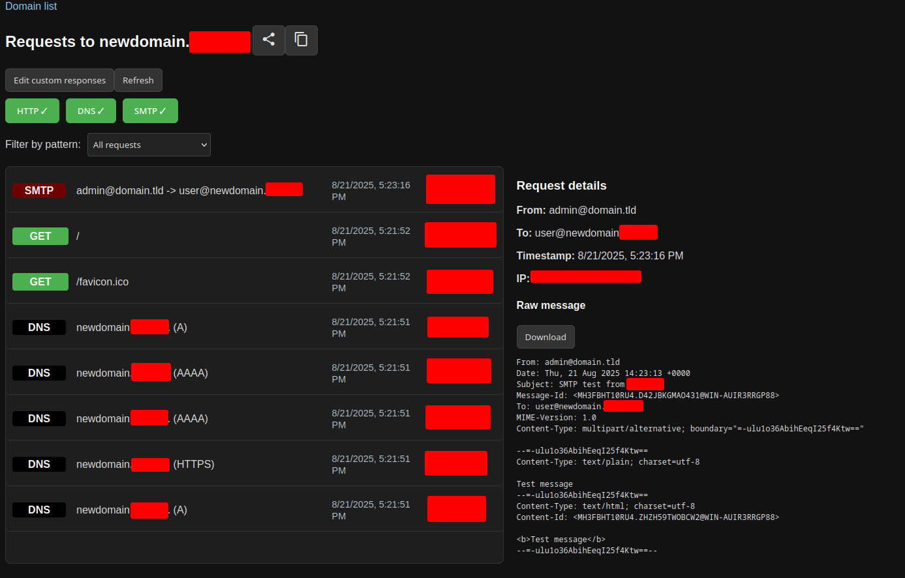
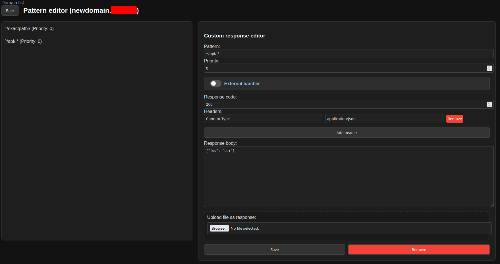

# collab2

## What does collab2 do?

In our work, we constantly face the need to receive external HTTP, DNS, and SMTP requests. Burp Collaborator handles this task, but we often wanted to add and extend its functionality. This led to the birth of the collab2 project: it's a tool with a web interface that allows you to collect requests just like Burp Collaborator, but also includes a number of features:

* Customization of HTTP responses, as well as the ability to assign an external handler for requests;
* Persistent storage for responses, and the ability to share access to a domain, making it easier to "collaborate" with colleagues.

The screenshots below demonstrate the interface and help to better understand the functionality being discussed:





## Deployment

This guide provides step-by-step instructions for deploying the collab2 application.

### Prerequisites

1. **Install Node.js and npm**
   ```bash
   # For Ubuntu/Debian
   curl -fsSL https://deb.nodesource.com/setup_lts.x | sudo -E bash -
   sudo apt-get install -y nodejs
   
   # For CentOS/RHEL
   curl -fsSL https://rpm.nodesource.com/setup_lts.x | sudo bash -
   sudo yum install -y nodejs
   
   # For Arch Linux
   sudo pacman -S nodejs npm
   ```

2. **Install Go**
   ```bash
   # For Ubuntu/Debian
   sudo apt-get install golang-go
   
   # For CentOS/RHEL
   sudo yum install golang
   
   # For Arch Linux
   sudo pacman -S go
   
   # Or download from official website
   # https://golang.org/dl/
   ```

3. **Install Docker and Docker Compose**
   https://docs.docker.com/engine/install/

### Configuration

1. **Create and configure .env file**
   
   Create a `.env` file in the project root with the following variables:
   ```bash
   COLLAB_IP=your_server_ip_here
   BASE_DOMAIN=your_domain_here
   ```

2. **Generate TLS certificates**
   
   Install and configure SSL certificates using certbot or your preferred method:
   ```bash
   # Install certbot
   sudo apt-get install certbot
   
   # Generate certificates for your domain and wildcard subdomains
   sudo certbot certonly --standalone -d your_domain_here -d *.your_domain_here
   
   # Certificates will be stored in /etc/letsencrypt/live/your_domain_here/
   ```

3. **Update docker-compose.yml with certificate paths**

   Replace the placeholder paths in `docker-compose.yml`:
   ```yaml
   # Replace these paths with your actual certificate locations
   - /etc/letsencrypt/live/your_domain_here/fullchain.pem:/etc/nginx/ssl/fullchain.pem
   - /etc/letsencrypt/live/your_domain_here/privkey.pem:/etc/nginx/ssl/privkey.pem
   - /etc/letsencrypt/live/your_domain_here/cert.pem:/etc/nginx/ssl/cert.pem
   ```

### Deployment Steps

1. **Run the preparation script**
   ```bash
   chmod +x prepare.sh
   ./prepare.sh
   ```
   This script will:
   - Generate nginx authentication password file
   - Update static files
   - Build the collab-agent

2. **Configure DNS**
   Configure your domain's DNS settings to point to your server:
   
   ```
   your_domain_here. NS ns1.your_domain_here
   ns1.your_domain_here. A your_server_ip_here
   ```

3. **Start the application**
   ```bash
   docker compose up --build -d
   ```

### Verification

After deployment, verify that:
- The application is accessible at `https://*.your_domain_here` and `https://your_domain_here:31337`
- All services are running: `docker compose ps`

### Troubleshooting

- **Certificate issues**: Ensure certificate paths in `docker-compose.yml` are correct
- **Port conflicts**: Check if ports 80, 443, 53, 25, 587, and 31337 are available
- **Permission issues**: Ensure Docker has proper permissions to access certificate files

### Maintenance

- **Update certificates**: Set up automatic renewal with certbot
- **Backup data**: Regular backups of the `dbdata` directory
- **Monitor logs**: Use `docker compose logs -f` for real-time monitoring